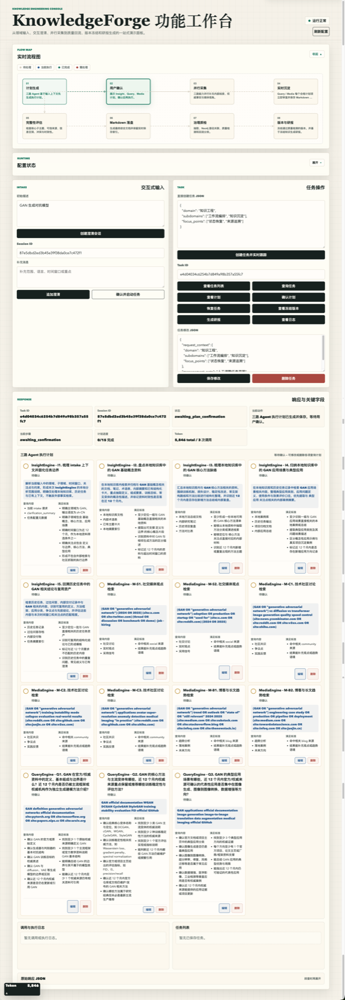
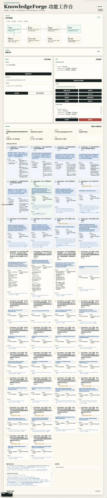
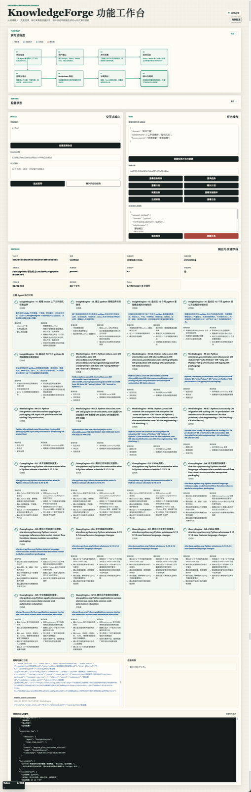

# KnowledgeForge

KnowledgeForge 是一个面向领域知识工程的知识库构建系统。它以领域主题为输入，通过 `LangGraph` 编排 `InsightEngine`、`QueryEngine`、`MediaEngine` 并行采集，再完成完整性评估、Markdown 落盘、Neo4j 路径关联、质量检测与冻结版本沉淀。

项目当前遵循以下约束：

- Web 界面基于 `Flask`
- 工作流编排基于 `LangGraph`
- 本地知识文档按 `save/{领域名称}/{子领域名称}/{文档文件名}.md` 存储
- 图谱存储基于 `Neo4j`
- `ChromaDB` 仅作为后续阶段预留能力

## 核心流程

1. 输入目标领域并补充检索边界
2. 并行生成并确认三路采集计划
3. 执行采集并按链接实时保存 Markdown 文档
4. 进行完整性评估、治理质检与回流分类
5. 冻结通过质检的知识版本，并按需生成研报

更多设计说明见：

- [docs/项目需求.md](docs/项目需求.md)
- [docs/知识文档格式规范.md](docs/知识文档格式规范.md)
- [docs/流程执行文档.md](docs/流程执行文档.md)

## 快速启动

1. 安装依赖

```bash
uv sync
```

2. 准备环境变量

```bash
cp .env.example .env
```

3. 按需填写 `.env`

- `OPENAI_API_KEY` / `OPENAI_BASE_URL` / `OPENAI_MODEL`
- `OPENAI_EMBEDDING_API_KEY` / `OPENAI_EMBEDDING_BASE_URL`
- `NEO4J_URI` / `NEO4J_USER` / `NEO4J_PASSWORD`
- `MYSQL_DATABASE_URL`

4. 启动 Web 控制台

```bash
uv run python app.py
```

默认访问地址：

- [http://127.0.0.1:5001](http://127.0.0.1:5001)

## 界面截图

### 控制台总览

展示流程图、交互式输入、任务操作和三路 Agent 执行计划。



### 运行中状态

展示补检索中的执行状态、实时保存结果与任务进度卡片。



### 爬取结束状态

展示治理链路完成后的结果状态，包括质量检查、冻结版本、保存文件数与已完成的三路 Agent 执行计划。



## 目录说明

- `knowledgeforge/`：Web 接口、服务层、编排图、后处理与基础配置
- `agent/`：`InsightEngine`、`QueryEngine`、`MediaEngine` 的能力实现
- `save/`：领域知识文档与 README 索引
- `docs/`：需求、流程、格式规范与设计资料
- `tests/`：自动化测试

## 当前状态

项目当前已具备：

- 领域输入与 intake 澄清会话
- 三路 Agent 计划生成、确认与执行
- Query / Media 链接级计划与单篇实时落盘
- 领域 README 与子领域 README 索引刷新
- 冻结版本查看与研报生成入口
