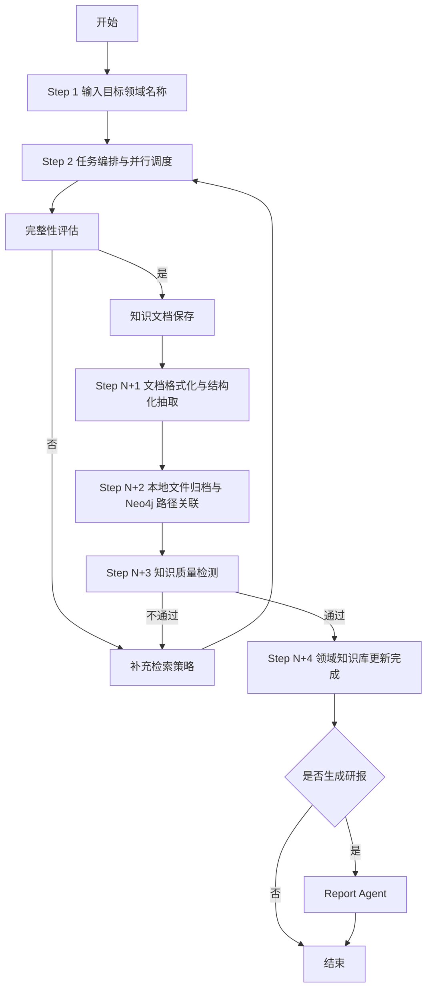

# KnowledgeForge 流程执行文档

> 目的：基于 `docs/流程图.excalidraw`，将当前设计中的主流程、并行采集、循环判断、知识入库与研报分支整理成一份可执行、可评审的流程文档。
>
> 注意：本文以当前流程图表达的目标流程为主，并参考已有设计文档统一术语；若与代码现状不一致，应优先在评审时标注“设计目标 / 当前实现”的差异。

## 1. 流程总览

KnowledgeForge 的整体执行目标是：

1. 输入目标领域名称。
2. 通过 LangGraph 编排并行启动多路采集 Agent。
3. 对采集结果做完整性评估，不足则继续补充检索。
4. 将原始资料沉淀为本地知识文档。
5. 对文档进行格式化、结构化抽取与知识表示转换。
6. 将结构化知识整理为本地文件，并基于保存位置在 Neo4j 中建立关联。
7. 执行知识质量检测，不通过则回流修复或补检索。
8. 完成领域知识库更新。
9. 根据需要触发研报生成流程。

可概括为：

---

## 2. 角色与核心模块

### 2.1 用户输入层

- **输入对象**：目标领域名称
- **入口形态**：Flask Web 接口
- **职责**：
  - 接收用户输入
  - 通过交互式询问细化检索方向
  - 为后续任务编排准备领域上下文

### 2.2 编排层

- **编排框架**：LangGraph
- **职责**：
  - 持有共享状态
  - 调度并行 Agent
  - 控制循环、分支与终止条件
  - 持久化执行状态并支持中断恢复

流程图中共享状态至少包括：

- 消息历史
- 采集元数据
- 论坛记录
- 逻辑大纲
- 冲突标记
- 知识入库状态
- 版本信息

### 2.3 三路采集 Agent

#### 1) Insight Agent

- 查询本地知识库 / 历史沉淀
- 适合补充内部已有认知、领域简介、背景线索
- 保存结果偏摘要化，便于后续本地检索复用

#### 2) Query Agent

- 补充外部事实、官方来源、权威文档
- 负责更强事实性、可引用性的信息采集
- 输出应带来源信息，便于后续验证与审查

#### 3) Media Agent

- 补充热点观点、社区讨论、媒体用法
- 用于增强时效性、应用场景与舆情视角
- 输出适合整理为观点型或趋势型材料

---

## 3. 主流程详细说明

## 3.1 Step 1：输入目标领域名称

### 输入

- 用户输入领域名称
- 用户补充的检索偏好、边界或子方向

### 处理动作

- Flask 接收请求
- 交互式询问用户以缩小领域范围
- 生成初始检索方向与上下文

### 输出

- 领域名称
- 初始检索策略
- 可进入编排层的任务上下文

### 执行要求

- 如果领域过大，应拆成更明确的子主题
- 如果用户目标不清晰，应在此阶段补足范围定义
- 不应在信息极度模糊时直接进入深度采集

---

## 3.2 Step 2：任务编排与并行调度

### 输入

- Step 1 输出的领域上下文
- LangGraph 当前共享状态

### 处理动作

编排层并行启动 3 个采集 Agent：

1. **Insight Agent**：查询本地知识库 / 历史沉淀
2. **Query Agent**：抓取外部事实 / 官方与权威来源
3. **Media Agent**：补充热点观点 / 社区与媒体用法

同时由编排层负责：

- 流程控制
- 任务分发
- 结果汇总
- 轮次状态更新

### 输出

- 三路原始采集结果
- 每一路的采集元数据
- 当前轮次的汇总状态

### 执行要求

- 三路采集应并行，以缩短整体等待时间
- 每个 Agent 的结果应保留来源信息
- 同一轮采集结果需要可回溯到具体 Agent

---

## 3.3 完整性评估

### 目标

判断当前轮次是否已经具备足够信息，可以进入知识沉淀阶段。

### 评估维度

建议至少检查以下问题：

- 是否覆盖核心子主题
- 是否存在高可信来源支撑
- 是否只有观点、缺少事实依据
- 是否存在明显的信息空洞
- 是否缺少时效性或应用层案例
- 是否存在相互冲突但尚未解释的结论

### 输出

- **是**：进入知识文档保存
- **否**：进入补充检索策略，再次发起并行采集

### 执行要求

- 完整性评估不是“信息越多越好”，而是“足够支持知识沉淀”
- 若某个关键子主题完全缺失，应直接判定为不完整
- 若只有媒体观点而缺少官方/权威依据，不应直接进入入库链路

---

## 3.4 补充检索策略

当完整性评估不通过，或后续质量检测失败时，需要回到检索策略调整阶段。

### 可调整项

- 细分主题
- 新来源类型
- 新时间窗口
- 新搜索关键词
- 反方向或争议性资料
- 官方文档优先级提升

### 输出

- 新一轮采集指令
- 修正后的搜索范围
- 定向补充任务

### 执行要求

- 补检索应针对缺口，而不是盲目重复搜索
- 每次回流要明确“为什么补”“补什么”
- 应避免无限循环，后续应配置轮次上限

---

## 3.5 知识文档保存

在完整性评估通过后，进入原始资料与中间成果沉淀阶段。

所有进入知识沉淀链路的知识文档都必须保存为统一结构的 Markdown 文件，并遵守 [知识文档格式规范](./知识文档格式规范.md)。该规范作为“保存 → 格式化 → 结构化抽取 → Neo4j 路径关联”的数据合同。

### 保存位置

- `save/{领域名称}/`
- 领域目录下继续按“子领域 / 相关文章”组织

### 各 Agent 保存规则

#### Insight

- 可沉淀为领域简介、背景说明或索引文档中的概览内容
- 目标是便于本地检索与历史复用

#### Query

- 保存抓取内容
- 必须注明来源
- 优先保留官方与权威信息的原始文本或摘要

#### Media

- 汇总热点 / 用法 / 观点
- 输出为 Markdown 文档

### 本地文件组织要求

- 每个领域目录必须包含一个结构目录索引文档
- 子领域目录用于承载该主题下的相关文章与补充材料
- 每篇文章都必须保存为 `.md` 文件
- 每篇文章都应包含所属领域、所属子领域、文档类型、来源类型、Agent、轮次、创建时间、修改时间、来源、状态、版本、本地路径等元信息
- 正文至少包含摘要、关键结论、正文、证据与来源、冲突与不确定性、后续动作、变更记录

### 输出

- 可追溯的原始资料
- Agent 中间产物
- 结构目录索引文档
- 后续结构化处理的输入材料

### 执行要求

- 资料保存应以可追踪为先，不要只保留最终摘要
- 任何进入后续知识抽取的材料都应能回溯来源与本地保存位置
- 若来源缺失，后续验证和质量检测会受阻
- 本地文件层级需要能够支撑 Neo4j 后续按路径建立关联

---

## 3.6 Step N+1：知识文档格式化 + 结构化抽取

### 输入

- 保存后的原始文档与中间资料

### 处理动作

按流程图定义，依次执行：

1. 文档解析（`marker-pdf`）
2. 结构化清洗
3. Chunk 切分
4. Metadata 提取
5. Entity 抽取
6. Relation 抽取

### 输出

- 结构化知识块
- 标准化元数据
- 实体与关系候选

### 执行要求

- 文档解析后的清洗规则要统一，避免不同来源格式差异过大
- Chunk 应能支撑向量检索与引用追溯
- 实体与关系抽取结果应保留来源指针

---

## 3.7 Step N+2：本地文件归档与 Neo4j 路径关联

### 输入

- 结构化知识块
- 元数据
- 实体关系信息

### 处理动作

将结构化知识整理为本地文件，并按保存位置建立图谱关联：

- **本地文件存储**：按领域 / 子领域 / 相关文章的层级写入知识文件
- **领域索引文档**：为每个领域生成结构目录索引文档
- **Neo4j**：基于本地保存位置保存领域、子领域、文章及其关系
- **ChromaDB**：职责暂未明确，当前阶段先保留，不纳入主流程依赖

### 输出

- 已写入的本地知识文件
- 已创建/更新的图谱节点与关系
- 文件路径到图谱节点的关联信息

### 执行要求

- 必须保证本地文件路径稳定且可追溯
- 失败时要能定位是文件写入失败、图谱写入失败，还是路径关联失败
- 建立关联前，知识对象应已具备最基本的审查、来源与时间元信息

---

## 3.8 Step N+3：知识质量检测

### 目标

对已入库知识执行质量校验，决定是否可视为一次有效更新。

### 检测项

根据流程图，至少包括：

- 冲突检测
- 重复检测
- 引用检查
- 图谱一致性校验

### 输出

- **通过**：进入“领域知识库更新完成”
- **不通过**：回流修复或补检索

### 不通过时的两类回流

#### 1) 回流修复

适用于：

- 结构化抽取错误
- 实体关系建模异常
- 图谱边错误
- 元数据缺失

#### 2) 回补检索

适用于：

- 证据不足
- 来源不够权威
- 引用链断裂
- 冲突无法裁决

### 执行要求

- 质量检测应明确问题类型，不要只给“失败”结论
- 回流应指向“修复”还是“补检索”，不能混淆
- 质量检测本身是入库后的闭环，不应省略

---

## 3.9 Step N+4：领域知识库更新完成

### 核心产出

- 本地知识文件更新
- Neo4j 图谱同步
- 版本记录完成

### 完成标志

- 当前知识对象已通过质量检测
- 本地文件与图谱状态一致
- 当前版本可被后续检索与研报系统消费

### 执行要求

- 每次成功更新都应形成版本记录
- 版本记录至少要能说明：本次更新了什么、来源于哪一轮采集、更新了哪些本地文件与图谱节点、是否存在保留问题

---

## 3.10 研报生成分支

### 分支条件

在知识库更新完成后，判断是否生成研报：

- **是**：进入 Report Agent
- **否**：流程结束

### Report Agent 输入

- 当前领域的结构化知识
- 本地文件知识内容
- 图谱关系信息
- 版本化后的知识上下文

### Report Agent 输出

- 面向用户的领域研报
- 可用于展示、导出或二次编辑的报告内容

### 执行要求

- 研报生成应依赖已完成质量校验的知识，而不是直接消费原始采集资料
- 若知识库更新未完成，不应直接跳过进入研报链路

---

## 4. 流程分支与回流规则

## 4.1 回流入口

当前流程图中存在两个主要回流入口：

1. **完整性评估不通过** → 补充检索策略 → 回到并行采集
2. **知识质量检测不通过** → 回流修复或补检索 → 回到前置阶段

## 4.2 推荐的回流判定规则

| 场景 | 回流方向 | 说明 |
|---|---|---|
| 信息覆盖不足 | 补充检索策略 | 补新的来源或子主题 |
| 只有观点缺少证据 | 补充检索策略 | 增加官方/权威来源 |
| 实体抽取错误 | 回流修复 | 重新结构化处理 |
| 关系建边异常 | 回流修复 | 重建图谱关系 |
| 引用链缺失 | 补充检索策略 | 找可追溯证据 |
| 重复严重 | 回流修复 | 做去重或合并 |
| 冲突未裁决 | 补充检索策略 | 补充反方或更高可信来源 |

## 4.3 终止建议

虽然流程图未写明终止保护，但执行文档建议至少补充：

- 最大采集轮次
- 最大质量回流次数
- 单轮最小新增信息阈值
- 人工介入条件

否则可能出现低价值循环。

---

## 5. 产物清单

流程执行过程中，建议明确管理以下产物：

### 5.1 原始采集产物

- Insight 摘要
- Query 原始抓取内容
- Media 观点汇总
- 来源链接与抓取元数据

### 5.2 中间处理产物

- 清洗后的文档
- Chunk 列表
- Metadata 列表
- Entity 列表
- Relation 列表

### 5.3 存储与关联产物

- 本地知识文件
- 领域结构目录索引文档
- 统一 Markdown 知识文档
- Neo4j 节点与边
- 文件路径与图谱节点关联信息
- 版本记录

### 5.4 最终产物

- 已更新的领域知识库
- 可选的领域研报

---

## 6. 执行时需要重点关注的问题

### 6.1 输入阶段

- 领域范围是否过大
- 是否需要拆分子主题
- 用户目标是否明确

### 6.2 采集阶段

- 三路采集是否分工清楚
- 来源是否足够可靠
- 是否偏向单一来源类型

### 6.3 结构化阶段

- Chunk 粒度是否适中
- 元数据是否完整
- 实体关系是否可追溯来源

### 6.4 存储与关联阶段

- 本地文件与 Neo4j 是否保持一致
- 文件路径与图谱节点关联是否缺失
- 是否能支持后续检索、目录导航与图谱遍历

### 6.5 质量阶段

- 冲突是否被显式处理
- 重复是否清理
- 引用是否完整
- 图谱是否一致

---

## 7. 建议在评审时重点确认的流程问题

基于当前流程图，这几个问题建议在后续评审时明确：

1. **完整性评估由谁执行？**
   - 是单独 Forum/Planner 节点，还是由编排层统一判断。

2. **知识文档保存与结构化抽取之间是否有明确数据合同？**
   - 当前已补充统一 Markdown 格式规范；后续需要确认是否拆分领域索引、版本记录、原始资料等专门模板。

3. **质量检测失败时，如何区分“修复”与“补检索”？**
   - 这是两类完全不同的回流路径。

4. **本地文件保存或 Neo4j 路径关联失败时的补偿策略是什么？**
   - 需要明确是回滚、重试，还是标记不一致状态。

5. **研报分支是否只消费已完成质量校验的知识？**
   - 如果直接消费未审查资料，报告可信度会下降。

6. **是否需要版本冻结点？**
   - 当知识库更新完成后，是否要以版本为单位供后续报告引用。

---

## 8. 一句话总结

**KnowledgeForge 的目标流程是：以 LangGraph 为编排中枢，围绕“输入领域 → 三路并行采集 → 完整性评估 → 知识沉淀 → 结构化抽取 → 本地文件归档 → Neo4j 路径关联 → 质量闭环 → 可选研报生成”形成一个可循环、可追溯、可持续更新的领域知识库构建流程。**
