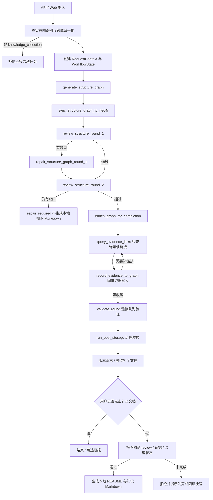

# KnowledgeForge 流程执行文档

> 目的：以当前代码为准，描述 KnowledgeForge 的真实执行流程、状态同步、文件写入、Neo4j 图谱更新和前端实时展示规则。
>
> 当前流程已从旧的“三路并行计划确认 → 采集 → 完整性评估”调整为“真实意图识别 → 知识架构图谱生成 → Neo4j 首屏呈现 → 两轮架构 review / 自动修补 → 图谱补全 → 可信证据链接查询 → 图谱证据写入 → 治理质检 → 等待补全文档”。

## 1. 流程总览

真实主流程如下：



前端流程图对应：

```text
意图识别 -> 图谱生成 -> Neo4j呈现 -> 架构Review -> 图谱补全 -> 证据链接 -> 图谱证据写入 -> 治理质检 -> 等待补全文档
```

## 2. 入口层

### 2.1 直接任务入口

接口：

- `POST /tasks`
- `POST /tasks/async`

执行规则：

- 输入可以是 `domain`、`message` 或 `original_input`。
- 服务端必须先调用 intake 归一化逻辑。
- `DL`、`ML`、`LLM` 等缩写会被规范化。
- 只有 `intent=knowledge_collection` 可以启动任务。
- 概念解释或普通问答类输入返回 400，要求用户先澄清。

响应要求：

- `request_context.domain`
- `request_context.normalized_domain`
- `request_context.original_input`
- `request_context.confirmed = true`

### 2.2 Intake 会话入口

接口：

- `POST /intake/sessions`
- `POST /intake/sessions/{session_id}/messages`
- `POST /intake/sessions/{session_id}/confirm`

执行规则：

- create / append 只更新 candidate context。
- confirm 仅在 `intent=knowledge_collection` 时创建异步任务。
- confirm 复用直接任务的异步启动路径。

## 3. WorkflowState

关键字段：

| 字段 | 含义 |
|---|---|
| `request_context` | 已确认的领域上下文 |
| `structure_graph` | LLM 或 fallback 生成的知识框架图谱 |
| `structure_graph_sync` | Neo4j 前置同步结果 |
| `structure_review_rounds` | 两轮架构 review 记录 |
| `structure_review_status` | `pending` / `passed` / `needs_repair` |
| `structure_repair_log` | 自动修补记录 |
| `generation_progress` | 当前图谱补全或补全文档进度 |
| `task_queue_path` | 运行态证据队列路径；不代表知识 Markdown 落盘 |
| `task_queue_snapshot` | 当前图谱级证据队列快照 |
| `workflow_events` | 流程事件 |
| `graph_snapshot` | SSE 可直接渲染的本地图谱快照 |
| `graph_event` | 最近一次图谱节点状态变化 |
| `file_update` | 最近一次可信链接记录事件 |
| `agent_outputs` | QueryEngine / 图谱证据写入的运行结果 |
| `post_storage_result` | 治理质检结果 |
| `task_status` | 任务终态或运行态 |
| `document_completion_status` | `not_requested` / `pending` / `generating` / `generated` / `rejected` |

## 4. Step 1：真实意图识别

### 输入

- 用户输入的 `domain`、`message` 或 intake 消息列表。

### 处理动作

- 调用 `IntakeClarifier`。
- 识别 `intent`。
- 归一化领域名。
- 生成默认 subdomains、focus_points、search_terms。

### 输出

- `RequestContext`
- 初始 `WorkflowState`

### 失败条件

- 输入为空：400。
- intent 不是 `knowledge_collection`：400。

## 5. Step 2：生成知识框架图谱

节点：`generate_structure_graph`

### 输入

- `RequestContext`

### 处理动作

1. 调用 LLM 生成结构图谱。
2. 失败时使用 fallback 图谱。
3. 标准化节点和边。
4. 记录学习角色、学习顺序、前置关系和官方证据需求等框架元信息。
5. 派生：
   - `knowledge_modules`
   - `core_topics`
   - `navigation_targets`
   - `knowledge_blueprint`
   - `required_files`
5. 初始化本地结构节点状态。
6. 前置同步到 Neo4j。

### 输出

- `structure_graph`
- `graph_snapshot`
- `graph_event=structure_graph_initialized`
- `current_step=structure_graph_ready`

## 6. Step 3：Neo4j 前置同步

### 写入对象

- `Domain`
- `KnowledgeStructureNode`
- `STRUCTURE_EDGE`

### 初始节点属性

```text
generation_state = planned
is_generated = false
is_completed = false
pending_task_count = 0
completed_task_count = 0
task_id = 当前任务 ID
domain = 当前领域
```

### 失败处理

- Neo4j 同步失败不阻断图谱规划和后续证据任务。
- 任务状态保留本地 `graph_snapshot`。
- `/tasks/{task_id}/graph` 在 Neo4j 不可用时返回本地快照 fallback。

## 7. Step 4：两轮架构 Review 与自动修补

节点：

```text
review_structure_round_1
repair_structure_graph_round_1
review_structure_round_2
```

处理动作：

1. 每轮 review 先查询当前 `knowledge_id` 在 Neo4j 中的相关结构节点、邻接关系和状态，并与本地 `structure_graph`、上一轮 review 记录一起拼接给 LLM。
2. LLM review 只做知识架构查漏补缺，输出可自动执行或继续由 LLM 补全的结构修补建议。
3. 每一轮 review 结束后都同步一次 Neo4j 知识图谱，使节点状态、review 结果和本地快照保持一致。
4. 如果有缺口，自动修补 `structure_graph` 并再次同步 Neo4j。
5. 第二轮 review 通过后才进入图谱补全和证据链接查询。
6. 第二轮仍不完整时，任务进入 `repair_required`，不生成本地知识 Markdown。

review 记录进入 `structure_review_rounds`，修补记录进入 `structure_repair_log`。

## 8. Step 5：图谱补全与补全文档上下文

节点：`enrich_graph_for_completion`

### 输入

- `structure_graph`
- `knowledge_blueprint`

### 处理动作

默认主链路只补全图谱上下文，不生成 `README.md`、基础知识 Markdown 或完整知识 Markdown。架构 review 通过后，对每个 blueprint 串行执行：

1. 标记结构节点为 `completion_ready` 前置准备态。
2. 写入知识定位、学习角色、前置关系、证据需求和建议路径。
3. 写入 `review_status`、`repair_log`、`suggested_relative_path`、`document_completion_status=not_requested`。
4. 从图谱节点证据需求派生 query 任务。
5. 将任务合并进运行态证据队列。
6. 更新 Neo4j、`graph_snapshot` 和 `graph_event`。

此步骤保存的是补全文档所需的结构化上下文。本地路径只作为建议路径或未来落盘路径保存，不代表文件已经存在。

### 后置补全文档路径

```text
save/{领域名称}/README.md
save/{领域名称}/{子领域名称}/{知识点文件名}.md
```

这些路径只在用户点击 `/tasks/{task_id}/documents/complete` 且前置检查通过后生成。

## 9. Step 6：执行证据链接队列

节点：`query_evidence_links`

### 输入

- 图谱级证据队列快照
- Neo4j 目标节点上下文

### 处理动作

按当前轮次遍历任务：

1. pending / insufficient 任务进入 `running`。
2. 对应结构节点进入 `link_querying`。
3. 仅调用 `QueryEngine.run_evidence_task`；`MediaEngine` 不参与默认主链路。
4. Engine 返回 sources，工作流只选择一个最贴近知识点且可访问的可信链接。
5. 队列任务更新为 `completed` 或 `insufficient`。
6. 写入 `selected_link`、`source_kind`、`reachable`、`relevance_reason`、`checked_at`。
7. 更新 Neo4j 目标节点、图谱证据字段和 SSE payload。
8. 不抓取网页内容补 Markdown，不追加 Agent 贡献区，不生成本地知识 Markdown。

### Query / Media 分工

| Engine | 当前职责 |
|---|---|
| QueryEngine | 官方、权威、Wiki、标准、论文、项目主页链接 |
| MediaEngine | 不参与默认架构证据链接阶段；保留给后续文档补全或扩展材料 |
| InsightEngine | 当前主流程中主要用于规划 / 验证 LLM 依赖，不作为默认并行采集分支 |

## 10. Step 7：图谱证据写入

触发点：每个链接任务完成后。

### 回写目标

1. 运行态链接队列字段
2. 本地 `structure_graph`
3. Neo4j 结构节点 / Article 节点
4. Neo4j 证据字段
5. `WorkflowState.graph_snapshot`
6. `WorkflowState.graph_event`
7. `WorkflowState.file_update`

### 链接记录规则

更新队列：

```text
task.status
task.citations
task.selected_link
task.source_kind
task.reachable
task.relevance_reason
task.checked_at
```

同步到 Neo4j 节点：

```text
evidence_links
selected_link
source_kind
reachable
relevance_reason
checked_at
claim_or_gap
expected_evidence
document_completion_status
```

不在主链路即时改写 Markdown 正文；本地 Markdown 由后置 `/documents/complete` 动作消费这些图谱链接和 review 上下文后生成。

### 图谱状态规则

- 任务运行中：`link_querying`
- 找到可访问链接：`link_verified`
- 任务无合格链接或异常：`link_failed`
- 架构阶段不执行父级状态聚合。

## 11. Step 8：轮次验证

节点：`validate_round`

### 处理动作

- 检查当前队列是否还有未完成任务。
- 调用 LLM 或 fallback 生成下一轮任务。
- 如果达到最大轮次，则保留缺口并进入收尾。
- 对链接队列状态做必要校验。
- 不做父级状态聚合；架构完整性由两轮 review 决定。

### 队列状态

| 状态 | 含义 |
|---|---|
| `generated` | 图谱级证据任务已生成，准备查询 |
| `needs_more_evidence` | 仍需下一轮证据 |
| `ready_for_governance` | 可进入治理质检 |

## 12. Step 9：治理前收尾校验

节点：`validate_round`

当前定位：

- 校验证据任务是否完成或达到最大轮次。
- 确认补全文档所需的图谱上下文是否具备最小条件。
- 不生成本地完整文档，不写本地知识 Markdown。
- 将 `document_completion_status` 保持为 `not_requested`，等待用户点击补全文档。

## 13. Step 10：后置治理

节点：`run_post_storage`

执行：

1. `StructuredExtractor.extract`
2. `Neo4jPathMapper.sync`
3. `QualityChecker.check`
4. `VersionRecorder.record`

质量标准：

- 默认主链路：检查知识架构图谱、两轮 review、官方或权威链接、Neo4j 路径关联和补全文档上下文状态。
- 补全文档动作完成后：继续检查本地 Markdown 结构、正文质量、引用链、contract 和实体关系候选。

输出：

- `verified`
- `research_required`
- `repair_required`

治理失败分类：

| 状态 | 含义 |
|---|---|
| `research_required` | 来源、证据、引用、冲突需要补检索 |
| `repair_required` | 结构化、元数据、图谱或路径需要修复 |

## 14. SSE 与前端同步

接口：

```text
GET /tasks/{task_id}/stream
```

payload 包含：

- 任务状态
- 日志摘要
- 队列快照
- token 统计
- `graph_snapshot`
- `graph_event`
- `file_update`

前端规则：

- 优先使用 SSE 中的 `graph_snapshot` 渲染图谱。
- 不再每次 SSE 更新后自动请求 `/graph`。
- `/tasks/{task_id}/graph` 仅作为手动刷新和 fallback。
- 前端摘要区展示：
  - 产出模式
  - 补全文档状态
  - 当前图谱节点
  - 当前链接任务
  - 图谱完成度
  - 架构 Review 状态
  - 最近链接

## 15. 产物清单

### 14.1 结构产物

- `structure_graph`
- `knowledge_blueprint`
- `navigation_targets`
- `required_files`
- Neo4j `KnowledgeStructureNode`

### 14.2 文件产物

- 默认主链路不生成本地知识 Markdown。
- 运行态状态、日志、缓存和队列文件可继续存在，但不视为知识文档落盘。
- 点击 `/tasks/{task_id}/documents/complete` 且检查通过后，生成领域 README、子领域 README / index 和知识点 Markdown。

### 14.3 队列产物

- `knowledge_task_queue.json`
- round summaries
- task citations
- generation status

### 14.4 治理产物

- structured extraction result
- graph sync result
- quality check result
- version record
- frozen version
- report artifact

## 16. 关键注意事项

- 文档与代码流程冲突时，以当前代码流程为准。
- “三路并行计划确认”是历史流程，不再是默认主线。
- 当前主线是知识架构图谱 + 两轮架构 review + 图谱级证据链接队列，默认仅 QueryEngine 执行链接查询。
- 旧的完整文档模式不再代表主链路直通能力；“补全文档”按钮是唯一的本地知识 Markdown 落盘入口。
- 未点击补全文档时，不生成 `save/{领域}/README.md` 或知识点 Markdown；运行态状态、日志、缓存和队列文件不属于知识文档落盘。
- Neo4j 是默认主链路的知识图谱事实源，记录结构关系、证据链接、建议路径、review 结果和补全文档上下文。
- ChromaDB 不在当前执行链路内。
- 链接结果记录是主流程，治理前收尾只做图谱证据与任务状态校验。

## 17. 验收检查

- 直接任务入口会归一化 `DL` 为 `Deep Learning`。
- 非知识采集 intent 无法直接启动任务。
- 结构图谱生成后 SSE 中可见 `graph_snapshot`。
- 架构 review 期间节点状态可流转到 `reviewing` / `repairing`。
- 架构 review 通过后，Neo4j 节点具备 `review_status`、`repair_log`、`suggested_relative_path` 和证据需求。
- 链接任务完成后，Neo4j 节点出现 `selected_link`、`reachable`、`source_kind`、`checked_at` 和关联 claim。
- 架构阶段不执行父级聚合。
- 前端不依赖自动请求 `/graph` 展示实时图谱。
- 未点击补全文档时，不要求本地知识 Markdown 存在。
- 点击补全文档后，才按既有目录规范生成本地 README 和知识点 Markdown。
- 治理链路仍能生成质量结果和版本资格。
