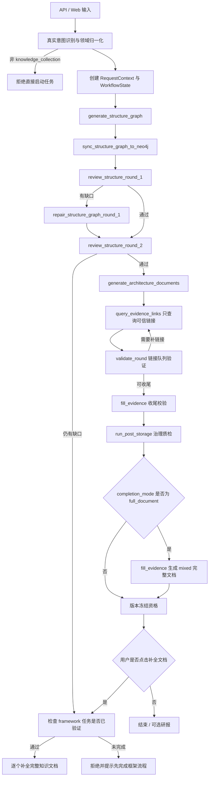

# KnowledgeForge 流程执行文档

> 目的：以当前代码为准，描述 KnowledgeForge 的真实执行流程、状态同步、文件写入、Neo4j 图谱更新和前端实时展示规则。
>
> 当前流程已从旧的“三路并行计划确认 → 采集 → 完整性评估”调整为“真实意图识别 → 知识架构图谱生成 → Neo4j 首屏呈现 → 两轮架构 review / 自动修补 → 架构文档生成 → 可信证据链接查询 → 治理质检 → 可选完整文档”。

## 1. 流程总览

真实主流程如下：



前端流程图对应：

```text
意图识别 -> 图谱生成 -> Neo4j呈现 -> 架构Review -> 架构文档 -> 证据链接 -> 治理质检 -> mixed 完整文档或版本研报
```

## 2. 入口层

### 2.1 直接任务入口

接口：

- `POST /tasks`
- `POST /tasks/async`

执行规则：

- 输入可以是 `domain`、`message` 或 `original_input`。
- 服务端必须先调用 intake 归一化逻辑。
- `DL`、`ML`、`LLM` 等缩写会被规范化。
- 只有 `intent=knowledge_collection` 可以启动任务。
- 概念解释或普通问答类输入返回 400，要求用户先澄清。

响应要求：

- `request_context.domain`
- `request_context.normalized_domain`
- `request_context.original_input`
- `request_context.confirmed = true`

### 2.2 Intake 会话入口

接口：

- `POST /intake/sessions`
- `POST /intake/sessions/{session_id}/messages`
- `POST /intake/sessions/{session_id}/confirm`

执行规则：

- create / append 只更新 candidate context。
- confirm 仅在 `intent=knowledge_collection` 时创建异步任务。
- confirm 复用直接任务的异步启动路径。

## 3. WorkflowState

关键字段：

| 字段 | 含义 |
|---|---|
| `request_context` | 已确认的领域上下文 |
| `structure_graph` | LLM 或 fallback 生成的知识框架图谱 |
| `structure_graph_sync` | Neo4j 前置同步结果 |
| `structure_review_rounds` | 两轮架构 review 记录 |
| `structure_review_status` | `pending` / `passed` / `needs_repair` |
| `structure_repair_log` | 自动修补记录 |
| `generation_progress` | 当前文件生成进度 |
| `task_queue_path` | `knowledge_task_queue.json` 路径 |
| `task_queue_snapshot` | 当前领域级证据队列快照 |
| `workflow_events` | 流程事件 |
| `graph_snapshot` | SSE 可直接渲染的本地图谱快照 |
| `graph_event` | 最近一次图谱节点状态变化 |
| `file_update` | 最近一次可信链接记录事件 |
| `agent_outputs` | QueryEngine / QueueFillPass 的运行结果 |
| `post_storage_result` | 治理质检结果 |
| `task_status` | 任务终态或运行态 |
| `completion_mode` | `framework` 或 `full_document` |
| `full_document_status` | `skipped` / `pending` / `generated` |

## 4. Step 1：真实意图识别

### 输入

- 用户输入的 `domain`、`message` 或 intake 消息列表。

### 处理动作

- 调用 `IntakeClarifier`。
- 识别 `intent`。
- 归一化领域名。
- 生成默认 subdomains、focus_points、search_terms。

### 输出

- `RequestContext`
- 初始 `WorkflowState`

### 失败条件

- 输入为空：400。
- intent 不是 `knowledge_collection`：400。

## 5. Step 2：生成知识框架图谱

节点：`generate_structure_graph`

### 输入

- `RequestContext`

### 处理动作

1. 调用 LLM 生成结构图谱。
2. 失败时使用 fallback 图谱。
3. 标准化节点和边。
4. 记录学习角色、学习顺序、前置关系和官方证据需求等框架元信息。
5. 派生：
   - `knowledge_modules`
   - `core_topics`
   - `navigation_targets`
   - `knowledge_blueprint`
   - `required_files`
5. 初始化本地结构节点状态。
6. 前置同步到 Neo4j。

### 输出

- `structure_graph`
- `graph_snapshot`
- `graph_event=structure_graph_initialized`
- `current_step=structure_graph_ready`

## 6. Step 3：Neo4j 前置同步

### 写入对象

- `Domain`
- `KnowledgeStructureNode`
- `STRUCTURE_EDGE`

### 初始节点属性

```text
generation_state = planned
is_generated = false
is_completed = false
pending_task_count = 0
completed_task_count = 0
task_id = 当前任务 ID
domain = 当前领域
```

### 失败处理

- Neo4j 同步失败不阻断文件生成。
- 任务状态保留本地 `graph_snapshot`。
- `/tasks/{task_id}/graph` 在 Neo4j 不可用时返回本地快照 fallback。

## 7. Step 4：两轮架构 Review 与自动修补

节点：

```text
review_structure_round_1
repair_structure_graph_round_1
review_structure_round_2
```

处理动作：

1. 第一轮 LLM review 检查知识架构是否完整、层级是否清晰、知识点覆盖是否足够。
2. 如果有缺口，自动修补 `structure_graph` 并再次同步 Neo4j。
3. 第二轮 review 通过后才进入本地架构文档生成。
4. 第二轮仍不完整时，任务进入 `repair_required`，不生成本地 Markdown。

review 记录进入 `structure_review_rounds`，修补记录进入 `structure_repair_log`。

## 8. Step 5：串行生成架构文档

节点：`generate_architecture_documents`

### 输入

- `knowledge_blueprint`
- `structure_graph`

### 处理动作

默认 `completion_mode=framework`，且只在架构 review 通过后，对每个 blueprint 串行执行：

1. 标记结构节点 `documenting`。
2. 更新 `generation_progress.current_file`。
3. 调用 LLM 生成架构 Markdown。
4. 若 LLM 失败，生成 fallback 架构 Markdown。
5. 写入目标 `.md` 文件。
6. 从 contract 中提取 `query_tasks`。
7. 将任务合并进 `knowledge_task_queue.json`。
8. 节点状态进入 `documented`。
9. 更新 `graph_snapshot` 和 `graph_event`。

`framework` 文件只包含知识定位、学习角色与路径、知识关系、证据与来源、后续动作和 contract，不生成完整正文。

`completion_mode=full_document` 时，此步骤仍先生成架构文档；随后主链路会在 `fill_evidence` 阶段生成 mixed 完整知识文档。与之并存的 `/tasks/{task_id}/documents/complete` 是 framework 任务完成后的后置逐文件补全文档动作。

### 文件路径

```text
save/{领域名称}/README.md
save/{领域名称}/{子领域名称}/{知识点文件名}.md
```

### 队列路径

```text
save/{领域名称}/knowledge_task_queue.json
```

## 9. Step 6：执行证据链接队列

节点：`query_evidence_links`

### 输入

- `knowledge_task_queue.json`

### 处理动作

按当前轮次遍历任务：

1. pending / insufficient 任务进入 `running`。
2. 对应结构节点进入 `link_querying`。
3. 仅调用 `QueryEngine.run_evidence_task`；`MediaEngine` 不参与默认主链路。
4. Engine 返回 sources，工作流只选择一个最贴近知识点且可访问的可信链接。
5. 队列任务更新为 `completed` 或 `insufficient`。
6. 写入 `selected_link`、`source_kind`、`reachable`、`relevance_reason`、`checked_at`。
7. 更新 Neo4j 目标节点和 SSE payload。
8. 不抓取网页内容补 Markdown，不追加 Agent 贡献区。

### Query / Media 分工

| Engine | 当前职责 |
|---|---|
| QueryEngine | 官方、权威、Wiki、标准、论文、项目主页链接 |
| MediaEngine | 不参与默认架构证据链接阶段；保留给后续文档补全或扩展材料 |
| InsightEngine | 当前主流程中主要用于规划 / 验证 LLM 依赖，不作为默认并行采集分支 |

## 10. Step 7：链接结果记录

触发点：每个链接任务完成后。

### 回写目标

1. `knowledge_task_queue.json`
2. 领域级链接队列字段
3. 本地 `structure_graph`
4. Neo4j 结构节点
5. `WorkflowState.graph_snapshot`
6. `WorkflowState.graph_event`
7. `WorkflowState.file_update`

### 链接记录规则

更新队列：

```text
task.status
task.citations
task.selected_link
task.source_kind
task.reachable
task.relevance_reason
task.checked_at
```

不在主链路即时改写 Markdown 正文；完整正文补全由后置 `/documents/complete` 动作消费这些链接。

### 图谱状态规则

- 任务运行中：`link_querying`
- 找到可访问链接：`link_verified`
- 任务无合格链接或异常：`link_failed`
- 架构阶段不执行父级状态聚合。

## 11. Step 8：轮次验证

节点：`validate_round`

### 处理动作

- 检查当前队列是否还有未完成任务。
- 调用 LLM 或 fallback 生成下一轮任务。
- 如果达到最大轮次，则保留缺口并进入收尾。
- 对链接队列状态做必要校验。
- 不做父级状态聚合；架构完整性由两轮 review 决定。

### 队列状态

| 状态 | 含义 |
|---|---|
| `generated` | 文件已生成，准备查询 |
| `needs_more_evidence` | 仍需下一轮证据 |
| `ready_for_fill` | 可进入收尾回填和治理 |

## 12. Step 9：收尾校验 / 可选完整文档

节点：`fill_evidence`

当前定位：

- 作为收尾校验和兼容层。
- 不再承担“主流程证据统一回填”的职责。
- `framework` 模式生成 `QueueFillPass` 输出，使用已完成的架构文档和可信链接队列进入治理链路，并标记 `full_document_status=skipped`。
- `full_document` 模式会在这里先把已验证链接通过 `QueueFillPass` 合并，再调用 `MarkdownKnowledgeWriter.write(...)` 生成 mixed 完整知识库文档，并标记 `full_document_status=generated`。

## 13. Step 10：后置治理

节点：`run_post_storage`

执行：

1. `StructuredExtractor.extract`
2. `Neo4jPathMapper.sync`
3. `QualityChecker.check`
4. `VersionRecorder.record`

质量标准：

- `framework`：检查知识架构图谱、两轮 review、架构文档、官方或权威链接、路径关联和 contract 状态。
- `full_document`：在 `framework` 标准基础上检查完整文档结构、正文质量、引用链和实体关系候选。

输出：

- `verified`
- `research_required`
- `repair_required`

治理失败分类：

| 状态 | 含义 |
|---|---|
| `research_required` | 来源、证据、引用、冲突需要补检索 |
| `repair_required` | 结构化、元数据、图谱或路径需要修复 |

## 13. SSE 与前端同步

接口：

```text
GET /tasks/{task_id}/stream
```

payload 包含：

- 任务状态
- 日志摘要
- 队列快照
- token 统计
- `graph_snapshot`
- `graph_event`
- `file_update`

前端规则：

- 优先使用 SSE 中的 `graph_snapshot` 渲染图谱。
- 不再每次 SSE 更新后自动请求 `/graph`。
- `/tasks/{task_id}/graph` 仅作为手动刷新和 fallback。
- 前端摘要区展示：
  - 产出模式
  - 完整文档状态
  - 当前文件
  - 当前链接任务
  - 图谱完成度
  - 架构 Review 状态
  - 最近链接

## 14. 产物清单

### 14.1 结构产物

- `structure_graph`
- `knowledge_blueprint`
- `navigation_targets`
- `required_files`
- Neo4j `KnowledgeStructureNode`

### 14.2 文件产物

- 领域 README
- 子领域 README / index
- 知识点架构 Markdown
- 实时来源资料 Markdown
- 可选最终 mixed 汇总文档
- Query plan 文档

### 14.3 队列产物

- `knowledge_task_queue.json`
- round summaries
- task citations
- generation status

### 14.4 治理产物

- structured extraction result
- graph sync result
- quality check result
- version record
- frozen version
- report artifact

## 15. 关键注意事项

- 文档与代码流程冲突时，以当前代码流程为准。
- “三路并行计划确认”是历史流程，不再是默认主线。
- 当前主线是知识架构图谱 + 两轮架构 review + 文件级证据链接队列，默认仅 QueryEngine 执行链接查询。
- `framework` 是默认和必须产物；Web UI 不在 intake 阶段选择完整文档；API / intake 若显式指定 `completion_mode=full_document`，主链路会直接生成 mixed 完整文档；“补全文档”按钮则用于 framework 任务完成后的逐文件补全。
- 本地 Markdown 是知识源事实；Neo4j 同时承担结构关系和实时进度图。
- ChromaDB 不在当前执行链路内。
- 链接结果记录是主流程，最终 `fill_evidence` 是收尾校验和兼容层。

## 16. 验收检查

- 直接任务入口会归一化 `DL` 为 `Deep Learning`。
- 非知识采集 intent 无法直接启动任务。
- 结构图谱生成后 SSE 中可见 `graph_snapshot`。
- 架构 review 期间节点状态可流转到 `reviewing` / `repairing`。
- 文件生成期间节点状态从 `planned` 流转到 `documenting` / `documented`。
- 链接任务完成后 `knowledge_task_queue.json` 出现 `selected_link`、`reachable` 和 `checked_at`。
- 架构阶段不执行父级聚合。
- 前端不依赖自动请求 `/graph` 展示实时图谱。
- 治理链路仍能生成质量结果和冻结版本。
