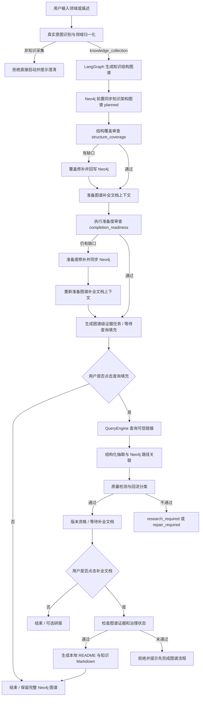

# KnowledgeForge — 项目需求

> **当前真实目标**：输入一个领域或自然语言描述后，系统先识别真实意图和规范领域名，再由 LLM 生成知识架构图谱、优先同步到 Neo4j 首屏呈现、执行“结构覆盖审查 + 执行准备度审查”的两段 review 与自动修补。默认主链路先停在完整 Neo4j 知识图谱；用户点击“查询填充”后才联网补充证据、治理质检并把已验证证据写入 Neo4j；“补全文档”和“生成研报”是后置可选动作。

## 1. 项目定位

KnowledgeForge 是一个面向领域知识沉淀的知识工程系统。

系统以用户输入的领域或描述为入口，通过 intake 识别真实意图，使用 LangGraph 编排“知识架构图谱生成 → Neo4j 呈现 → 结构覆盖审查 / 自动修补 → 图谱补全文档上下文准备 → 执行准备度审查 / 自动修补 → 图谱完成”的图谱生成闭环，先形成可追溯、可迭代、可图谱化展示的领域知识架构。可信证据链接查询、治理质检和 Neo4j 图谱证据写入由后置“查询填充”动作触发；完整本地知识库文档只由后置“补全文档”动作触发。

## 2. 核心目标

1. 支持用户输入目标领域、缩写或自然语言描述，并归一化为稳定领域名，例如 `DL` → `Deep Learning`。
2. 支持直接任务入口和 intake 会话入口使用同一套真实意图识别逻辑。
3. 支持先生成知识框架图谱，再派生二级领域、知识点文件蓝图、学习路径、证据需求和保存路径。
4. 支持将结构图谱前置同步到 Neo4j，作为实时任务进度图。
5. 支持两段 LLM review：第一段 `structure_coverage` 只审知识图谱结构覆盖，第二段 `completion_readiness` 在补全文档上下文准备后审证据需求、query 任务、建议路径和治理准备度；每段发现缺口后自动修补并同步 Neo4j，第二段仍不完整时也直接使用自动修补后的图谱继续主链路，不等待人工恢复。
6. 默认支持审查通过后把知识点蓝图、证据需求、建议路径和补全文档上下文写入 Neo4j，而不是立即落本地 Markdown。
7. 支持“查询填充”按钮；用户触发后由 QueryEngine 可信链接查询补充图谱证据，主链路不执行 MediaEngine 证据任务。
8. 支持每条链接任务完成后更新运行态任务状态和 SSE payload，并在查询填充流程内完成治理质检与 Neo4j 图谱证据写入；不把网页内容、摘要或架构正文即时写回 Markdown。
9. 支持后置结构化抽取、Neo4j 路径关联、质量检测、版本资格、补全文档按钮和可选研报。
10. `ChromaDB` 当前仅预留，不纳入主流程依赖。

## 3. 核心产出

- **Neo4j 实时知识图谱**：默认主产物，保存 Domain、SubTopic、Article / KnowledgeStructureNode 及结构边，并记录架构 review、建议路径、补全文档状态和链接验证状态。
- **图谱证据上下文**：默认先记录待查询证据队列；用户点击“查询填充”后，再联网补充并写入 Neo4j 节点字段 `evidence_links`、`selected_link`、`source_kind`、`reachable`、`relevance_reason`、`checked_at`、`claim_or_gap`、`expected_evidence`、`review_status`、`repair_log`、`suggested_relative_path`、`document_completion_status`。
- **运行态队列 / 状态**：记录链接任务、轮次、任务状态和生成进度；这些运行文件不属于本地知识 Markdown 产物。
- **SSE 实时事件**：返回任务状态、图谱快照、图谱事件和最近链接记录事件。
- **版本记录**：记录完成治理的知识对象、来源轮次、文件路径、图谱节点和质量状态。
- **后置补全文档动作**：唯一的本地知识 Markdown 落盘入口；用户点击“补全文档”后，系统检查架构 review、证据链接和治理状态，再生成 `save/{领域名称}/README.md` 与 `save/{领域名称}/{子领域名称}/{文档文件名}.md`。
- **可选研报**：只消费已冻结、通过质量检测的知识版本。

## 4. 主流程



主流程要求：

- 所有入口必须先完成真实意图识别，直接 API 不允许绕过。
- 非 `knowledge_collection` 输入不得直接启动采集任务。
- 每个知识结构节点必须有稳定 `node_id`、`relative_path`、`generation_state`、`pending_task_count`、`completed_task_count`。
- 每个知识结构节点必须能回溯到来源、Agent、轮次、时间、建议路径和链接任务。
- 本地路径在主链路中只作为 `suggested_relative_path` 或未来落盘路径保存到图谱，不代表文件已存在。
- 旧的完整文档模式不再作为主链路直通能力；完整 Markdown 只由 `/tasks/{task_id}/documents/complete` 后置动作生成。
- 每次架构 review、证据任务或图谱状态变化都要更新任务快照，供 SSE 推送。
- 回流必须说明是 `research_flow` 还是 `repair_flow`，不能返回泛化失败。

## 5. 功能需求

### 5.1 输入与意图识别

- `/tasks`、`/tasks/async`、`/intake/sessions` 必须共享同一套领域归一化逻辑。
- 领域缩写要归一化为规范英文名，例如：
  - `ML` → `Machine Learning`
  - `DL` → `Deep Learning`
  - `LLM` → `Large Language Models`
- `concept_explanation` 或 `qa` 类输入不得直接启动知识库采集。
- 用户通过 intake 补充范围后，可以确认并启动异步任务。

### 5.2 LangGraph 编排

默认图谱生成工作流节点为：

```text
generate_structure_graph
  -> sync_structure_graph_to_neo4j
  -> review_structure_round_1(structure_coverage)
  -> repair_structure_graph_round_1(可选)
  -> prepare_graph_completion_context
  -> review_structure_round_2(completion_readiness)
  -> repair_structure_graph_round_2(可选)
  -> prepare_graph_completion_context(仅第二段修补后重跑)
  -> finalize_graph_for_completion
  -> END(graph_ready)
```

“查询填充”按钮触发后的工作流节点为：

```text
query_evidence_links
  -> validate_round
  -> query_evidence_links (when more evidence is needed)
  -> run_post_storage
  -> record_evidence_to_graph
```

编排层职责：

- 持有 `WorkflowState`。
- 持久化任务状态和中间快照。
- 维护 `workflow_events`、`generation_progress`、`task_queue_snapshot`、`graph_snapshot`、`graph_event`、`file_update`。
- 控制证据任务轮次和最大轮次保护。
- 支持恢复执行。

### 5.3 知识框架图谱与蓝图

系统先由 LLM 生成知识框架图谱，失败时使用 fallback 图谱。

结构图谱至少包含：

- `Domain` / domain node
- `SubTopic` / subtopic node
- `Article` / knowledge point node
- `Index` / index node
- `STRUCTURE_EDGE` / `CONTAINS` 等结构关系
- 学习角色、学习顺序、前置关系、官方证据需求等框架元信息

结构图谱派生：

- `knowledge_modules`
- `core_topics`
- `navigation_targets`
- `knowledge_blueprint`
- `required_files`

### 5.4 Neo4j 实时任务图

结构图谱生成后立即同步到 Neo4j。

结构节点状态：

| 状态 | 含义 |
|---|---|
| `planned` | 已规划，已可在 Neo4j 中呈现 |
| `reviewing` | 架构 review 正在执行 |
| `repairing` | review 后正在自动修补图谱 |
| `approved` | 架构审查通过 |
| `completion_ready` | 图谱上下文已满足补全文档前置条件 |
| `document_generating` | 用户已点击补全文档，正在生成本地 Markdown |
| `documented` | 补全文档动作已生成本地 Markdown |
| `link_querying` | 正在查询可信证据链接 |
| `link_verified` | 已找到可访问且贴近知识点的可信链接 |
| `link_failed` | 未找到合格链接，需要 research flow |
| `failed` | 架构生成、文档生成或链接查询失败，需要 repair flow 或 research flow 处理 |

节点属性至少包括：

- `generation_state`
- `is_generated`
- `is_completed`
- `suggested_relative_path`
- `generated_path`
- `completed_at`
- `pending_task_count`
- `completed_task_count`
- `parent_node_id`
- `task_id`
- `domain`
- `evidence_links`
- `selected_link`
- `source_kind`
- `reachable`
- `relevance_reason`
- `checked_at`
- `claim_or_gap`
- `expected_evidence`
- `review_status`
- `repair_log`
- `document_completion_status`

架构阶段不做父级完成聚合；父级是否完整与可执行准备度由两段 review 的结果决定。补全文档阶段如需展示落盘进度，可在补全文档任务中另行聚合。

### 5.5 补全文档生成模式

默认主链路不生成本地知识 Markdown。以下保存路径只在用户点击 `/tasks/{task_id}/documents/complete` 且前置检查通过后生成：

```text
save/{领域名称}/README.md
save/{领域名称}/{子领域名称}/{文档文件名}.md
```

补全文档动作生成的每个知识点文件必须包含：

- YAML front matter。
- 知识定位、学习角色与路径、知识关系、证据与来源、冲突与不确定性、后续动作、变更记录。
- `<!-- knowledgeforge:contract ... -->` contract 块，记录 claims、evidence_needed、query_tasks、completion_status。
- 官方文档、标准、规范、权威论文、项目主页或 Wikipedia 优先的链接任务。

未点击补全文档时，不要求 `save/{领域名称}/README.md` 或任何知识点 Markdown 存在；运行态状态、日志、缓存和队列文件不视为知识文档落盘。

### 5.6 图谱级证据链接队列

架构 review 通过后，系统从知识图谱节点的证据需求和蓝图上下文派生链接任务。任务可保存在运行态队列中，但补全文档所需的最终证据信息必须写入 Neo4j。

队列任务至少包含：

- `task_id`
- `task_type`: `query`
- `target_node_id`
- `suggested_relative_path`
- `target_section`
- `claim_or_gap`
- `query_text`
- `expected_evidence`
- `status`
- `citations`
- `selected_link`
- `source_kind`
- `reachable`
- `relevance_reason`
- `checked_at`
- `round_number`

### 5.7 Query 证据链接执行

- `QueryEngine` 负责官方、权威、Wiki、标准、项目主页等可信链接发现。
- `MediaEngine` 不参与默认架构证据链接阶段，可在后续文档补全或扩展材料中使用。
- 当前主流程按图谱级链接队列执行，不再以“三路并行计划确认”作为默认主线。
- `InsightEngine` 当前主要参与规划 / 验证 LLM 客户端和结构上下文，不是默认并行采集分支。

### 5.8 链接结果记录

每个链接任务完成后立即执行：

1. 更新运行态任务状态、citations、selected_link、source_kind、reachable、relevance_reason、checked_at。
2. 不抓取网页内容补全文档，不追加 Agent 贡献区，不生成正文摘要，不写本地知识 Markdown。
3. 更新 Neo4j 目标节点状态、pending / completed 计数、证据链接字段和任务 SSE payload。
4. 更新任务状态中的 `graph_snapshot`、`graph_event`、`file_update`。
5. 通过 SSE 将最新链接状态推送到前端。

### 5.9 后置治理与质量检测

收尾后执行：

1. 结构化抽取。
2. Neo4j 文档路径关联。
3. 质量检测。
4. 版本记录。
5. 可选冻结版本和研报生成。

质量检测要求：

- 默认主链路检查知识架构图谱完整度、两段 review 结果、官方/权威链接覆盖、图谱路径关联和补全文档上下文状态。
- 补全文档动作完成后，再检查本地 Markdown 结构、正文质量、引用链、contract 和实体关系候选。

质量检测失败时必须区分：

| 问题类型 | 回流方向 |
|---|---|
| 结构化抽取错误、实体关系异常、元数据缺失、路径关联异常 | `repair_flow` |
| 证据不足、来源不权威、引用链断裂、冲突无法裁决 | `research_flow` |

## 6. 实时前端要求

- `/tasks/{task_id}/stream` 使用 SSE。
- SSE payload 必须包含任务状态和可选的 `graph_snapshot`、`graph_event`、`file_update`。
- 前端优先使用 SSE 中的 `graph_snapshot` 渲染 Neo4j 图谱。
- `/tasks/{task_id}/graph` 保留为手动刷新和 Neo4j 不可用时的 fallback。
- 前端流程图展示：

```text
意图识别 -> 图谱生成 -> Neo4j呈现 -> 结构覆盖审查 -> 图谱上下文准备 -> 执行准备度审查 -> 查询填充 -> 治理质检 -> 图谱证据写入 -> 可选补全文档 -> 可选版本研报
```

## 7. 非功能需求

- **可追溯**：所有知识对象可追踪来源、Agent、轮次、时间、建议路径和链接任务。
- **实时性**：证据任务和图谱状态变化后应更新任务快照并经 SSE 可见。
- **一致性**：运行态队列、补全文档上下文和 Neo4j 节点状态保持一致；Markdown contract 只在补全文档动作生成后参与一致性检查。
- **可恢复**：任务状态和队列文件持久化，支持中断恢复。
- **可循环优化**：证据不足时支持多轮补充，并设置最大轮次保护。
- **可审查**：质量检测、版本更新、图谱状态变化和研报引用都必须留有审查记录。

## 8. 技术约束

- Web 接口：Flask
- 流程编排：LangGraph
- 文档解析：marker-pdf 预留 / 文档解析阶段使用结构化抽取接口
- 本地存储：仅补全文档动作生成领域 / 子领域 / 知识点 Markdown 目录
- 知识图谱：Neo4j
- 实时同步：SSE
- 向量能力：ChromaDB 预留

不得破坏以下核心能力：

- 真实意图识别与领域归一化。
- 结构图谱前置同步。
- 图谱级证据链接任务队列。
- 链接记录和状态同步。
- 补全文档时的本地文件稳定存储与路径关联。
- 来源追溯与质量闭环。

## 9. 验收标准

1. `/tasks/async` 输入 `{"domain": "DL"}` 后，任务上下文中的 `domain` 和 `normalized_domain` 均为 `Deep Learning`。
2. 概念解释类输入不能直接启动知识库采集。
3. 结构图谱生成后，任务状态和 Neo4j 中可见 planned 结构节点。
4. 两段 review 均有 `structure_review_rounds` 记录，并通过 `review_type` 区分 `structure_coverage` 与 `completion_readiness`；第二段不通过时系统自动修补、同步 Neo4j，并继续图谱完成，不要求用户手动恢复。
5. 架构 review 通过后，Neo4j 节点记录 `review_status`、`repair_log`、证据需求和 `suggested_relative_path`。
6. 每个链接任务完成后，运行态队列记录 `selected_link`、`reachable`、`source_kind`、`checked_at` 和关联 claim；只有点击补全文档后，这些证据字段才写入 Neo4j。
7. 架构阶段不做父级完成聚合；架构完整性与执行准备度由两段 review 决定。
8. SSE payload 能返回 `graph_snapshot`、`graph_event`、`file_update`。
9. 前端不依赖轮询任务状态展示图谱进度；`/graph` 仅作为手动刷新或 fallback。
10. 未点击补全文档时，不要求 `save/{领域}/README.md` 或知识点 Markdown 存在；点击补全文档后，才按既有目录规范生成本地 Markdown。
11. 后置治理通过后获得版本资格；不通过时能区分 `research_required` 与 `repair_required`。
