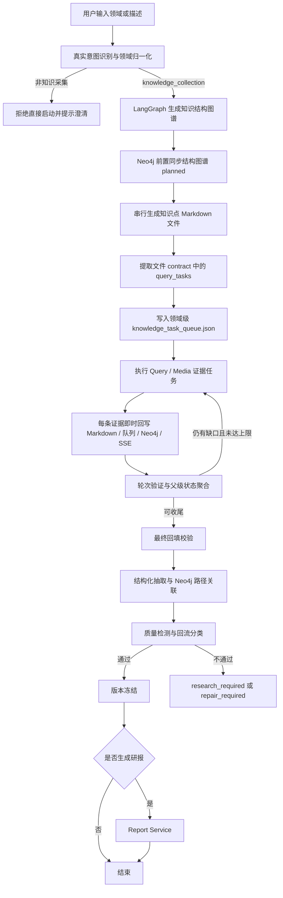

# KnowledgeForge — 项目需求

> **当前真实目标**：输入一个领域或自然语言描述后，系统先识别真实意图和规范领域名，再生成领域知识结构图谱、初始化 Neo4j 任务图、串行生成每个知识点 Markdown 文件、按文件级证据队列补充来源，并在每个状态变化时通过 SSE 同步前端。研报生成是知识库完成治理后的可选能力。

## 1. 项目定位

KnowledgeForge 是一个面向领域知识沉淀的知识工程系统。

系统以用户输入的领域或描述为入口，通过 intake 识别真实意图，使用 LangGraph 编排“结构图谱规划 → 文件生成 → 证据查询 → 即时回写 → 治理质检 → 版本冻结”的闭环，最终形成可追溯、可迭代、可图谱化展示的本地 Markdown 知识库。

## 2. 核心目标

1. 支持用户输入目标领域、缩写或自然语言描述，并归一化为稳定领域名，例如 `DL` → `Deep Learning`。
2. 支持直接任务入口和 intake 会话入口使用同一套真实意图识别逻辑。
3. 支持先生成知识结构图谱，再派生二级领域、知识点文件蓝图和保存路径。
4. 支持将结构图谱前置同步到 Neo4j，作为实时任务进度图。
5. 支持串行生成每个知识点 Markdown 文件，并保存证据占位和 `query_tasks` contract。
6. 支持按领域级 `knowledge_task_queue.json` 执行 Query / Media 证据任务。
7. 支持每条证据任务完成后即时回写目标 Markdown、任务队列、Neo4j 节点和 SSE payload。
8. 支持父级 SubTopic / Domain 根据子节点完成情况自动聚合状态。
9. 支持后置结构化抽取、Neo4j 路径关联、质量检测、版本冻结和可选研报。
10. `ChromaDB` 当前仅预留，不纳入主流程依赖。

## 3. 核心产出

- **本地文件知识库**：按领域 / 子领域 / 知识点组织，所有知识文档统一保存为 Markdown。
- **领域任务队列**：`save/{领域名称}/knowledge_task_queue.json`，记录文件级证据任务、轮次、任务状态和生成进度。
- **Neo4j 实时知识图谱**：保存 Domain、SubTopic、Article / KnowledgeStructureNode 及结构边，并记录文件路径、生成状态、证据状态和完成状态。
- **SSE 实时事件**：返回任务状态、图谱快照、图谱事件和最近文件回写事件。
- **版本记录**：记录完成治理的知识对象、来源轮次、文件路径、图谱节点和质量状态。
- **可选研报**：只消费已冻结、通过质量检测的知识版本。

## 4. 主流程



主流程要求：

- 所有入口必须先完成真实意图识别，直接 API 不允许绕过。
- 非 `knowledge_collection` 输入不得直接启动采集任务。
- 每个知识结构节点必须有稳定 `node_id`、`relative_path`、`generation_state`、`pending_task_count`、`completed_task_count`。
- 每个知识点文件必须能回溯到来源、Agent、轮次、时间、本地路径和证据任务。
- 每次文件、队列或图谱状态变化都要更新任务快照，供 SSE 推送。
- 回流必须说明是 `research_flow` 还是 `repair_flow`，不能返回泛化失败。

## 5. 功能需求

### 5.1 输入与意图识别

- `/tasks`、`/tasks/async`、`/intake/sessions` 必须共享同一套领域归一化逻辑。
- 领域缩写要归一化为规范英文名，例如：
  - `ML` → `Machine Learning`
  - `DL` → `Deep Learning`
  - `LLM` → `Large Language Models`
- `concept_explanation` 或 `qa` 类输入不得直接启动知识库采集。
- 用户通过 intake 补充范围后，可以确认并启动异步任务。

### 5.2 LangGraph 编排

当前工作流节点为：

```text
generate_structure_graph
  -> generate_files
  -> run_query_queue
  -> validate_round
  -> fill_evidence
  -> run_post_storage
```

编排层职责：

- 持有 `WorkflowState`。
- 持久化任务状态和中间快照。
- 维护 `workflow_events`、`generation_progress`、`task_queue_snapshot`、`graph_snapshot`、`graph_event`、`file_update`。
- 控制证据任务轮次和最大轮次保护。
- 支持恢复执行。

### 5.3 知识结构图谱与蓝图

系统先由 LLM 生成结构图谱，失败时使用 fallback 图谱。

结构图谱至少包含：

- `Domain` / domain node
- `SubTopic` / subtopic node
- `Article` / knowledge point node
- `Index` / index node
- `STRUCTURE_EDGE` / `CONTAINS` 等结构关系

结构图谱派生：

- `knowledge_modules`
- `core_topics`
- `navigation_targets`
- `knowledge_blueprint`
- `required_files`

### 5.4 Neo4j 实时任务图

结构图谱生成后立即同步到 Neo4j。

结构节点状态：

| 状态 | 含义 |
|---|---|
| `planned` | 已规划，尚未生成文件 |
| `generating` | 文件正在生成 |
| `generated` | 文件已落盘，无证据任务或尚未进入证据阶段 |
| `evidence_pending` | 文件已生成，仍有证据任务待处理 |
| `evidence_running` | 文件相关证据任务正在执行 |
| `completed` | 文件 contract 无 pending task，节点完成 |
| `failed` | 文件生成或证据任务失败，需要人工或回流处理 |

节点属性至少包括：

- `generation_state`
- `is_generated`
- `is_completed`
- `generated_path`
- `completed_at`
- `pending_task_count`
- `completed_task_count`
- `parent_node_id`
- `task_id`
- `domain`

父级聚合规则：

- 所有 required 子节点完成后，父级 SubTopic 标记为 `completed`。
- 所有 SubTopic / required 结构节点完成后，Domain 标记为 `completed`。
- 只要存在运行中子节点，父级保持 `evidence_running` 或相应进行中状态。

### 5.5 Markdown 文件生成

保存路径：

```text
save/{领域名称}/README.md
save/{领域名称}/{子领域名称}/{文档文件名}.md
save/{领域名称}/knowledge_task_queue.json
```

每个知识点文件必须包含：

- YAML front matter。
- 摘要、关键结论、背景与上下文、正文、证据与来源、实体与关系候选、冲突与不确定性、后续动作、变更记录。
- `<!-- knowledgeforge:contract ... -->` contract 块，记录 claims、evidence_needed、query_tasks、completion_status。

### 5.6 文件级证据队列

文件生成后，从 contract 中提取 `query_tasks` 并写入领域级队列。

队列任务至少包含：

- `task_id`
- `task_type`: `query` 或 `media`
- `target_file_path`
- `target_section`
- `claim_or_gap`
- `query_text`
- `expected_evidence`
- `status`
- `citations`
- `round_number`

### 5.7 Query / Media 证据执行

- `QueryEngine` 负责权威事实、官方资料、标准、可靠引用。
- `MediaEngine` 负责社区观点、趋势、案例、实践反馈。
- 当前主流程按文件级任务队列执行，不再以“三路并行计划确认”作为默认主线。
- `InsightEngine` 当前主要参与规划 / 验证 LLM 客户端和结构上下文，不是默认并行采集分支。

### 5.8 即时回写

每个证据任务完成后立即执行：

1. 更新 `knowledge_task_queue.json` 中任务状态、摘要、citations。
2. 更新目标 Markdown contract 中对应 `query_task.status`、`citation`、`completion_status.completed_task_ids`、`completion_status.pending_task_ids`。
3. 将证据摘要写入目标 Markdown 的 Agent 贡献区或证据相关区域。
4. 更新 Neo4j 节点状态、pending / completed 计数和父级聚合状态。
5. 更新任务状态中的 `graph_snapshot`、`graph_event`、`file_update`。
6. 通过 SSE 将最新状态推送到前端。

### 5.9 后置治理与质量检测

收尾后执行：

1. 结构化抽取。
2. Neo4j 文档路径关联。
3. 质量检测。
4. 版本记录。
5. 可选冻结版本和研报生成。

质量检测失败时必须区分：

| 问题类型 | 回流方向 |
|---|---|
| 结构化抽取错误、实体关系异常、元数据缺失、路径关联异常 | `repair_flow` |
| 证据不足、来源不权威、引用链断裂、冲突无法裁决 | `research_flow` |

## 6. 实时前端要求

- `/tasks/{task_id}/stream` 使用 SSE。
- SSE payload 必须包含任务状态和可选的 `graph_snapshot`、`graph_event`、`file_update`。
- 前端优先使用 SSE 中的 `graph_snapshot` 渲染 Neo4j 图谱。
- `/tasks/{task_id}/graph` 保留为手动刷新和 Neo4j 不可用时的 fallback。
- 前端流程图展示：

```text
意图识别 -> 图谱规划 -> 文件生成 -> 证据查询 -> 即时回写 -> 父级聚合 -> 治理质检 -> 版本研报
```

## 7. 非功能需求

- **可追溯**：所有知识对象可追踪来源、Agent、轮次、时间、本地路径和证据任务。
- **实时性**：文件、队列、图谱状态变化后应更新任务快照并经 SSE 可见。
- **一致性**：Markdown contract、领域队列和 Neo4j 节点状态保持一致。
- **可恢复**：任务状态和队列文件持久化，支持中断恢复。
- **可循环优化**：证据不足时支持多轮补充，并设置最大轮次保护。
- **可审查**：质量检测、版本更新、图谱状态变化和研报引用都必须留有审查记录。

## 8. 技术约束

- Web 接口：Flask
- 流程编排：LangGraph
- 文档解析：marker-pdf 预留 / 文档解析阶段使用结构化抽取接口
- 本地存储：领域 / 子领域 / 知识点 Markdown 目录
- 知识图谱：Neo4j
- 实时同步：SSE
- 向量能力：ChromaDB 预留

不得破坏以下核心能力：

- 真实意图识别与领域归一化。
- 结构图谱前置同步。
- 文件级证据任务队列。
- 即时回写和状态同步。
- 本地文件稳定存储与路径关联。
- 来源追溯与质量闭环。

## 9. 验收标准

1. `/tasks/async` 输入 `{"domain": "DL"}` 后，任务上下文中的 `domain` 和 `normalized_domain` 均为 `Deep Learning`。
2. 概念解释类输入不能直接启动知识库采集。
3. 结构图谱生成后，任务状态和 Neo4j 中可见 planned 结构节点。
4. 单个文件生成开始 / 完成时，节点状态分别进入 `generating` 和 `generated` / `evidence_pending` / `completed`。
5. 每个证据任务完成后，目标 Markdown contract 立即出现 completed task id 和 citation。
6. `knowledge_task_queue.json` 与 Markdown contract 的任务状态一致。
7. 子节点全部完成后，SubTopic 自动完成；所有 required 子结构完成后，Domain 自动完成。
8. SSE payload 能返回 `graph_snapshot`、`graph_event`、`file_update`。
9. 前端不依赖轮询任务状态展示图谱进度；`/graph` 仅作为手动刷新或 fallback。
10. 后置治理通过后生成冻结版本；不通过时能区分 `research_required` 与 `repair_required`。
