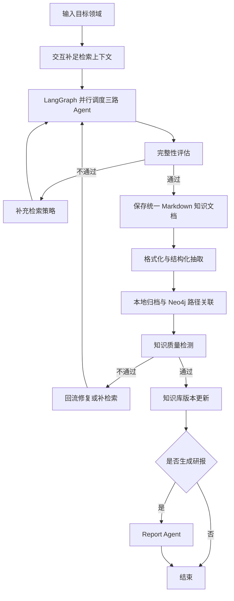

# KnowledgeForge — 项目需求

> **核心目标**：输入一个目标领域名称，系统自动完成多路采集、完整性评估、知识沉淀、结构化抽取、本地文件存储、Neo4j 路径关联、质量校验与版本更新，持续构建可追溯、可迭代的领域知识库。研报生成是知识库更新完成后的可选能力。

## 1. 项目定位

KnowledgeForge 是一个面向领域知识沉淀的知识工程系统。

系统以目标领域为输入，通过 LangGraph 编排多路采集 Agent，完成“采集 → 评估 → 入库 → 质检 → 回流”的闭环，最终形成可检索、可引用、可版本化管理的领域知识库。

## 2. 核心目标

1. 支持用户输入目标领域，并通过交互补足范围、边界和关注重点。
2. 支持 Insight、Query、Media 三路 Agent 并行采集。
3. 支持完整性评估，不足时自动生成补检索策略。
4. 支持将资料沉淀为统一 Markdown 知识文档。
5. 支持文档解析、清洗、Chunk 切分、Metadata / Entity / Relation 抽取。
6. 支持按领域 / 子领域 / 文章组织本地文件，并与 Neo4j 建立路径关联。
7. 支持知识质量检测，不通过时区分“修复”与“补检索”。
8. 支持版本记录，并在需要时生成领域研报。

## 3. 核心产出

- **本地文件知识库**：按领域 / 子领域 / 文章组织，所有知识文档统一保存为 Markdown。
- **Neo4j 图谱**：保存 Domain、SubTopic、Article 及实体关系，并记录本地文件路径。
- **版本记录**：记录每次更新的知识对象、来源轮次、文件路径、图谱节点和质量状态。
- **可选研报**：只消费已通过质量检测的知识版本。
- **ChromaDB**：当前阶段预留，不纳入主链路依赖。

知识文档格式遵守 [知识文档格式规范](./知识文档格式规范.md)。

## 4. 主流程



主流程要求：

- 所有知识对象必须保留来源、Agent、轮次、时间和本地路径。
- 回流必须说明原因和目标，不能无差别重复采集。
- 系统必须支持多轮执行、状态持久化和中断恢复。

## 5. 功能需求

### 5.1 输入与交互

- 接收目标领域名称。
- 当领域过大或目标模糊时，追问子方向、边界、时间范围和关注重点。
- 输出可进入编排层的领域上下文和初始检索策略。

### 5.2 LangGraph 编排

- 维护消息历史、采集元数据、冲突标记、入库状态和版本信息。
- 支持并行调度、条件分支、循环控制、状态持久化和中断恢复。
- 每轮执行需要记录输入、输出、Agent 结果和回流原因。

### 5.3 三路采集 Agent

| Agent | 职责 | 输出重点 |
|---|---|---|
| Insight Agent | 查询本地知识库和历史沉淀 | 背景、概览、内部线索 |
| Query Agent | 检索外部事实、官方和权威来源 | 可引用事实、来源链接 |
| Media Agent | 补充热点、社区讨论和媒体观点 | 趋势、用法、应用视角 |

统一要求：

- 三路采集并行执行。
- 输出必须包含来源、Agent 标识、轮次和采集时间。
- Query 类资料优先保留官方和权威来源。

### 5.4 完整性评估与补检索

完整性评估至少检查：

- 核心子主题是否覆盖。
- 是否有高可信来源支撑。
- 是否只有观点而缺少事实。
- 是否存在信息空洞、过时信息或未解释冲突。

不通过时，系统生成补检索策略，明确：

- 为什么补。
- 补什么主题、来源或时间窗口。
- 下一轮采集的关键词和优先级。

### 5.5 知识文档保存

保存路径：

```text
save/{领域名称}/{子领域名称}/{文档文件名}.md
```

领域目录必须包含：

```text
save/{领域名称}/README.md
```

保存要求：

- 每篇知识文档必须是 `.md` 文件。
- 每篇文档必须包含 YAML front matter、摘要、关键结论、正文、证据来源、冲突与不确定性、后续动作、变更记录。
- 文档必须能回溯到来源、Agent、轮次和本地路径。
- 不得只保留最终摘要，必须保留原始资料或可追溯引用。

详细模板见 [知识文档格式规范](./知识文档格式规范.md)。

### 5.6 结构化抽取

对保存后的知识文档执行：

1. 文档解析，PDF 优先使用 `marker-pdf`。
2. 结构化清洗。
3. Chunk 切分。
4. Metadata 提取。
5. Entity 抽取。
6. Relation 抽取。

抽取结果必须保留来源指针和本地路径。

### 5.7 本地归档与 Neo4j 关联

本地文件职责：

- 保存领域、子领域、文章和索引文档。
- 提供稳定文件路径，作为 Neo4j 映射基础。

Neo4j 职责：

- 保存 Domain、SubTopic、Article 等节点。
- 保存领域层级、文章归属和知识关系。
- 记录与本地文件一致的 `id`、`path`、`status`、`version`。

失败时需要区分：

- 文件写入失败。
- 图谱写入失败。
- 路径关联失败。

### 5.8 质量检测与回流

质量检测项：

- 冲突检测。
- 重复检测。
- 引用检查。
- 图谱一致性校验。

失败回流规则：

| 问题类型 | 回流方向 |
|---|---|
| 结构化抽取错误、实体关系异常、元数据缺失 | 回流修复 |
| 证据不足、来源不权威、引用链断裂、冲突无法裁决 | 补检索 |

质量检测必须输出明确问题类型，不能只返回“失败”。

### 5.9 版本更新与研报

质量检测通过后，生成版本记录，至少包含：

- 更新了哪些知识对象。
- 来源于哪一轮采集。
- 写入了哪些本地文件和图谱节点。
- 是否存在保留问题。
- 更新时间和版本标识。

研报生成要求：

- 只消费已通过质量检测的知识。
- 不得直接使用未审查的原始采集资料。
- 作为可选分支，不影响主链路闭环。

## 6. 非功能需求

- **可追溯**：所有知识对象可追踪来源、Agent、轮次、时间和本地路径。
- **一致性**：本地文件与 Neo4j 节点关系保持一致。
- **可恢复**：LangGraph 状态可持久化，支持中断恢复，目标恢复时间小于 2 秒。
- **可循环优化**：支持多轮补检索和回流修复，并设置最大轮次保护。
- **可审查**：质量检测、版本更新和研报引用都必须留有审查记录。

## 7. 技术约束

- Web 接口：Flask
- 流程编排：LangGraph
- 文档解析：marker-pdf
- 本地存储：领域 / 子领域 / 文章目录
- 知识图谱：Neo4j
- 向量能力：ChromaDB 预留

不得破坏以下核心能力：

- 并行采集。
- 状态持久化与恢复。
- 本地文件稳定存储与路径关联。
- 来源追溯与质量闭环。

## 8. 验收标准

1. 用户输入领域后，系统能生成明确检索上下文。
2. 系统能并行启动三路 Agent 并汇总结果。
3. 系统能完成完整性评估，并在不足时自动补检索。
4. 系统能按统一 Markdown 结构保存知识文档。
5. 系统能完成 Chunk、Metadata、Entity、Relation 抽取。
6. 系统能基于本地路径建立 Neo4j 关联。
7. 系统能完成冲突、重复、引用和图谱一致性检测。
8. 系统能区分回流修复和补检索。
9. 系统能生成可追踪版本记录。
10. 系统能在知识库更新完成后按需生成研报。

## 9. 待确认事项

1. 完整性评估由独立节点执行，还是由编排层统一判断。
2. 是否需要为领域索引、版本记录、原始资料分别扩展专门模板。
3. 本地文件保存失败或 Neo4j 关联失败时采用重试、回滚还是标记不一致状态。
4. 版本冻结点、版本命名规则和对外可见策略。
5. ChromaDB 在后续阶段的职责。
